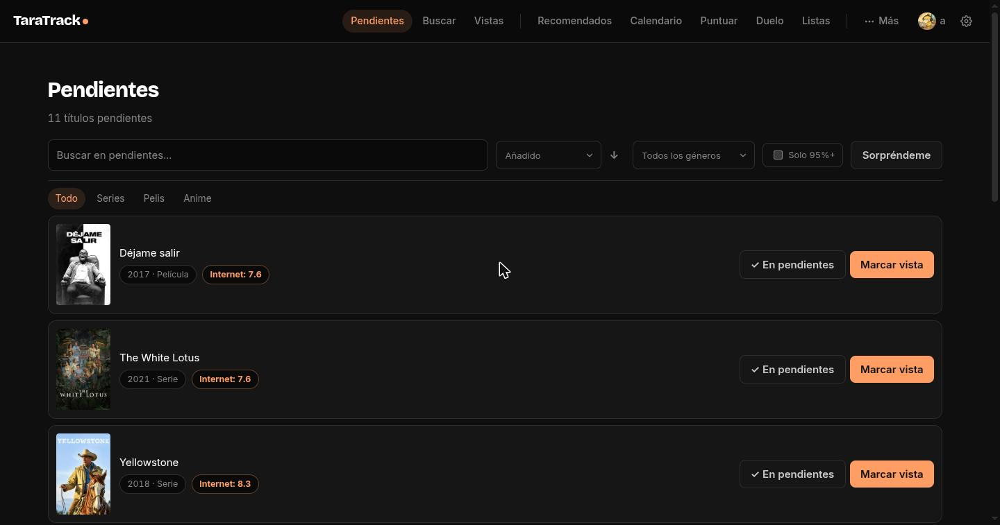
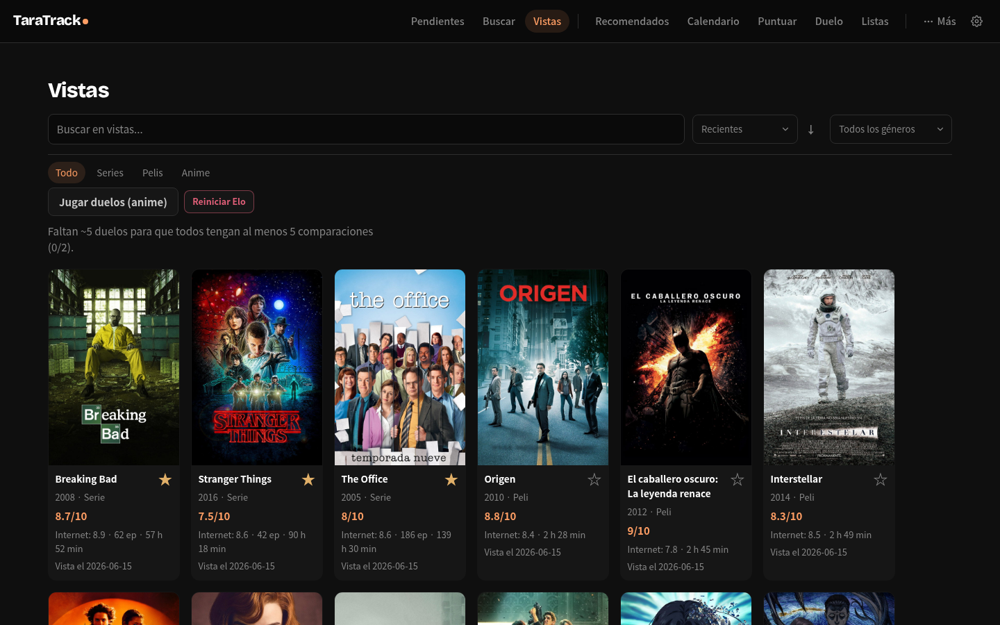
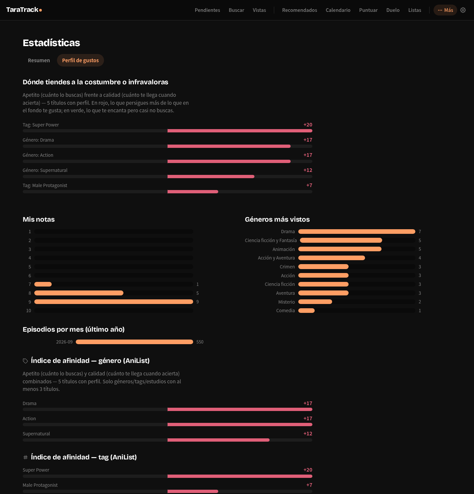

# TaraTrack

Mi segundo proyecto de este verano (el primero fue [TarArch](https://github.com/Tara7ara/TarArch), mi escritorio Linux) — en desarrollo activo desde hace varios meses, el historial de commits de este repo es reciente porque lo publico ahora, no porque se haya hecho en un día.

Tracker personal de series y películas, autoalojado y de un solo usuario — un sustituto propio de Trakt/TV Time. FastAPI + Jinja2 + htmx + SQLite, server-rendered, sin build step de frontend.

Los metadatos vienen de TMDB (y de Jikan/AniList para anime), pero en la base de datos solo se guarda lo que realmente sigues: lo pendiente, lo visto, tus notas, tus listas y tus personajes favoritos.

## Capturas

_(biblioteca de ejemplo, no la real — ver "Índice de afinidad" más abajo para lo interesante de verdad)_





## Arrancar en local

```bash
pip install -r requirements.txt
TMDB_API_KEY=... TARATRACK_SECRET_KEY=... TARATRACK_PASSWORD=... TARATRACK_DB_PATH=./taratrack.db uvicorn app.main:app --reload
```

Abre http://127.0.0.1:8000. El esquema se crea solo al arrancar (`init_db()`): no hay paso de migración manual.

La única credencial externa necesaria es una API key v3 de [TMDB](https://www.themoviedb.org/settings/api) (gratis). Jikan y AniList no piden key. `TARATRACK_SECRET_KEY`/`TARATRACK_PASSWORD` son del login propio (cookie firmada de 1 año, sin dependencia de ningún proxy) — sin `TARATRACK_SECRET_KEY` el arranque falla a propósito, no hay valor por defecto.

## Índice de afinidad

La app no se queda en "nota media por género" — eso castiga justo lo que más consumes (a más volumen visto de un género, más obras mediocres de ese género entran en la media, y la media baja). En vez de una sola métrica, `app/repo/affinity.py` (~1100 líneas) separa dos ejes por atributo (género/tag/estudio):

- **Apetito**: cuánto lo persigues de verdad — volumen (episodios, agrupados por franquicia vía union-find sobre precuelas), qué cuota de tu consumo se lleva frente al resto de tu biblioteca, ritmo al salir episodios, si lo ves el día 1, rewatches, si lo has curado en listas propias.
- **Calidad**: cuánto te gusta cuando lo ves — percentil 85 de tus notas en ese atributo (no la media, que se hunde con el volumen), percentil 25, disfrute, corrección por tu ranking de duelos (Elo/Glicko).

Ambos se normalizan a percentil dentro de tu propio perfil y se combinan con **media geométrica ponderada + castigo si te alejas de la diagonal**: `base = apetito^0.6 · calidad^0.4`, y si apetito supera a calidad por más de 25 puntos, la afinidad se recorta hasta un 50% — es la señal de "esto lo ves por costumbre, no porque te guste tanto". Esa diferencia (apetito − calidad) es la **inercia**: positiva = lo persigues más de lo que te gusta, negativa = te gusta más de lo que lo persigues (candidato a que le des más bola).

El score final no se enseña en crudo — se calibra contra la distribución real de tus propias notas (percentil: "95%" = mejor que el 95% de lo que has visto en tu vida) y se valida con **backtesting leave-one-out**: recalcula tu perfil sacando cada título puntuado uno a uno, predice su nota sin haberlo visto, y compara contra la real (`scripts/tune_affinity_weights.py` hace un grid search sobre los pesos usando este mismo mecanismo).

**Marcado de hábito** (`entries.is_habit`): series de fondo tipo sitcom/kids que ves por costumbre, no porque las persigas de verdad — se excluyen del eje apetito (no del de calidad, tu nota sigue contando) para que no infle esa métrica solo por volumen. Sin este flag, un estudio como el de una serie con miles de episodios vistos salía con "inercia +47" solo por volumen bruto.

## Más detalle

- [`docs/architecture.md`](docs/architecture.md) — estructura de carpetas, modelo de datos, tests, Docker, sincronización de fondo, scripts de import.
- [`docs/engineering-notes.md`](docs/engineering-notes.md) — cuatro problemas reales resueltos: migraciones SQLite idempotentes, matching TMDB/AniList sin falsos positivos, backtesting sin fuga de datos, y una ronda de seguridad en sesiones/cookies.
