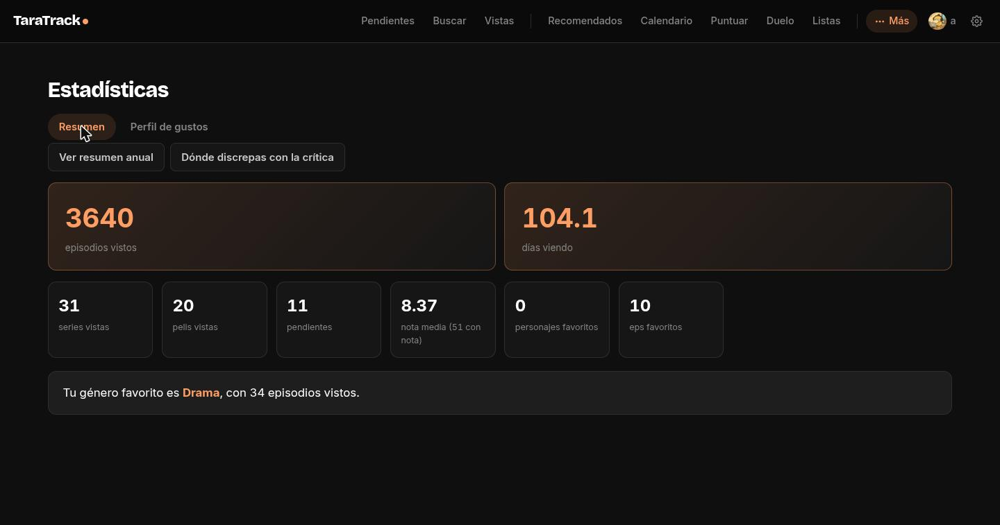
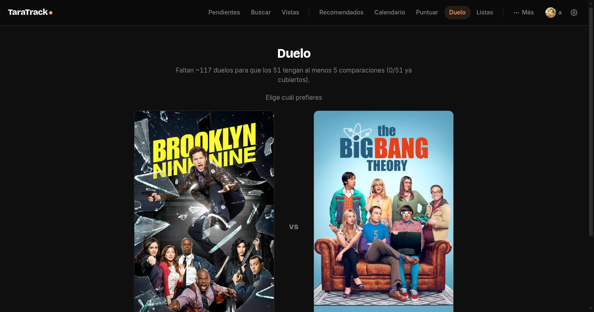

# TaraTrack

> Tu historial de series, películas y anime; tus notas, tus gustos y tus recomendaciones, en tu propio servidor.

No intenta ser otra base de datos de títulos: intenta entender qué te apetece de verdad, no solo qué has visto.

Tracker personal autoalojado, sustituto propio de Trakt/TV Time. FastAPI + Jinja2 + htmx + SQLite, server-rendered, sin build step de frontend.

Los metadatos vienen de TMDB (y de Jikan/AniList para anime), pero en la base de datos solo se guarda lo que realmente sigues: lo pendiente, lo visto, tus notas, tus listas y tus personajes favoritos.

## Capturas

_(biblioteca de ejemplo; no contiene datos personales)_





## Hecho para usarlo cada día

- **Nunca pierdes historial al volver a ver algo**: un rewatch no borra ninguna fecha anterior, solo recalcula qué falta "ahora mismo".
- **Recomendaciones explicables, no una caja negra**: cada predicción se apoya en dos ejes separados (cuánto lo persigues, cuánto te gusta cuando lo ves) y se valida contra tu propio historial, no contra una nota media genérica.
- **Calendario de temporada con predicción propia**: todo el anime de la temporada, con un "% que te va a gustar" calculado desde tus notas — nunca desde la nota media de la crítica.
- **Ranking por duelos con Glicko**, no un Elo de toda la vida: cada elemento lleva su propia incertidumbre, así que el ranking se afina más rápido con menos duelos.
- **Multiusuario real**: cuentas aisladas de verdad, no una contraseña compartida con un "modo invitado".
- **Autoalojado y privado**: tus datos personales no salen de tu servidor — TMDB/AniList/Jikan solo se consultan para traer metadatos.

## Arrancar en local

```bash
cp .env.example .env   # rellena TMDB_API_KEY, TARATRACK_SECRET_KEY y TARATRACK_PASSWORD
pip install -r requirements.txt
uvicorn app.main:app --reload --env-file .env
```

Abre http://127.0.0.1:8000. El esquema se crea solo al arrancar (`init_db()`): no hay paso de migración manual.

La única credencial externa necesaria es una API key v3 de [TMDB](https://www.themoviedb.org/settings/api) (gratis). Jikan y AniList no piden key. Sin `TARATRACK_SECRET_KEY` el arranque falla a propósito, no hay valor por defecto — para Docker y despliegue en un servidor, ver [`docs/architecture.md`](docs/architecture.md).

### Comprobar que funciona

```bash
pytest -q
ruff check .
```

## Funciones diferenciales

- **Puntuación por categorías**: un "examen" corto (Historia, Animación, Personajes, Música, Disfrute) con pesos distintos por categoría en vez de un número suelto.
- **Calendario semanal** estilo Trakt, con sincronización automática cada 12 h.
- **Listas ilimitadas**, con orden manual o por duelos (mismo motor Glicko que el ranking general).
- **Autover**: series de muchos episodios que sigues sin pensarlo se marcan vistas solas.
- **Personajes de anime reales, no actores**: para anime se tira de AniList/Jikan en vez del reparto de TMDB.
- **Resumen anual** tipo "wrapped" y **discrepancias con la crítica** (tu nota vs. Internet).
- **Exportación completa de tus datos** en JSON, pensada para migrar a otra herramienta si hace falta — no solo un backup.

## Índice de afinidad

```
apetito + calidad  →  afinidad     (cuánto te va a gustar)
apetito − calidad  →  inercia      (costumbre vs. gusto real)
predicción         →  backtesting  (validada contra tu propio historial)
```

La app no se queda en "nota media por género" — eso castiga justo lo que más consumes (a más volumen visto de un género, más obras mediocres de ese género entran en la media, y la media baja). En vez de una sola métrica, `app/repo/affinity.py` (~1100 líneas) separa dos ejes por atributo (género/tag/estudio):

- **Apetito**: cuánto lo persigues de verdad — volumen (episodios, agrupados por franquicia vía union-find sobre precuelas), qué cuota de tu consumo se lleva frente al resto de tu biblioteca, ritmo al salir episodios, si lo ves el día 1, rewatches, si lo has curado en listas propias.
- **Calidad**: cuánto te gusta cuando lo ves — percentil 85 de tus notas en ese atributo (no la media, que se hunde con el volumen), percentil 25, disfrute, corrección por tu ranking de duelos Glicko.

Ambos se normalizan a percentil dentro de tu propio perfil y se combinan con **media geométrica ponderada + castigo si te alejas de la diagonal**: `base = apetito^0.6 · calidad^0.4`, y si apetito supera a calidad por más de 25 puntos, la afinidad se recorta hasta un 50% — es la señal de "esto lo ves por costumbre, no porque te guste tanto". Esa diferencia (apetito − calidad) es la **inercia**: positiva = lo persigues más de lo que te gusta, negativa = te gusta más de lo que lo persigues (candidato a que le des más bola).

El score final no se enseña en crudo — se calibra contra la distribución real de tus propias notas (percentil: "95%" = mejor que el 95% de lo que has visto en tu vida) y se valida con **backtesting leave-one-out**: recalcula tu perfil sacando cada título puntuado uno a uno, predice su nota sin haberlo visto, y compara contra la real (`scripts/tune_affinity_weights.py` hace un grid search sobre los pesos usando este mismo mecanismo).

**Marcado de hábito** (`entries.is_habit`): series de fondo tipo sitcom/kids que ves por costumbre, no porque las persigas de verdad — se excluyen del eje apetito (no del de calidad, tu nota sigue contando) para que no infle esa métrica solo por volumen. Sin este flag, un estudio como el de una serie con miles de episodios vistos salía con "inercia +47" solo por volumen bruto.

## Multiusuario

Varias cuentas reales en la misma instancia (pensado para 2-3 personas de confianza compartiendo un despliegue, no para un servicio público): cada una con su propio seguimiento, notas, listas, índice de afinidad, duelos Glicko y personajes favoritos — aislado del resto, solo el catálogo de títulos/episodios se comparte entre cuentas (evita descargar los mismos metadatos dos veces).

- **Cuentas**: usuario + contraseña (`pbkdf2_hmac`, sin dependencia nueva tipo `passlib`), autoregistro público desde `/login`.
- **Comentarios por episodio**: la única pieza pensada para verse *entre* cuentas — un hilo de debate por episodio, oculto/difuminado hasta que tú mismo lo has marcado como visto (con opción de saltarte el spoiler).
- **Admin**: la primera cuenta puede crear cuentas nuevas, dar/quitar el rol de admin a otras, y resetearles la contraseña si la pierden — no hay email de por medio, es la única vía de recuperación real en un self-host así.
- **Términos que se adaptan solos**: si una cuenta no tiene anime en su biblioteca, "Waifus" pasa a llamarse "Personajes favoritos" y el "Duelo" cae a comparar toda tu biblioteca vista en vez de quedarse vacío.

## Privacidad y límites

- Los datos se quedan en tu instancia; TMDB/AniList/Jikan se usan solo para consultar metadatos, nunca reciben tus notas ni tu biblioteca.
- Está pensado para una instancia privada compartida con pocas personas, no para abrir registros en Internet — el autoregistro presupone que ya estás detrás de una red privada (VPN, LAN).
- La sesión es una cookie firmada de larga duración (para no reintroducir la contraseña cada dos por tres); "Cerrar sesión" en Ajustes la borra.
- Haz backup del volumen de datos y de los de imágenes si despliegas con Docker — ver [`docs/architecture.md`](docs/architecture.md).

## Diseño

Tema único, oscuro — paleta propia "Warm Dark" con tres capas de profundidad (fondo/superficie/elevación) en vez de todo plano. Pensado como un producto de consumo, no como un panel de administración: sin `window.confirm()`/`alert()` en ningún sitio (confirmación siempre en dos pasos), sin saltos bruscos al cargar una portada, con estados de carga y accesibilidad cuidados de verdad.

## Calidad y arquitectura

26 módulos (rutas por dominio + capa de datos separada por subsistema), sin ORM y sin SQL fuera de esa capa; 129 tests + `ruff` en cada despliegue. Login propio con una ronda de seguridad dedicada tras una revisión externa del código (clave de sesión sin valor por defecto, rate-limit por cuenta, validación de subidas — ver [`docs/engineering-notes.md`](docs/engineering-notes.md)). Detalle completo de estructura, modelo de datos y Docker en [`docs/architecture.md`](docs/architecture.md).

## Estado

En desarrollo activo, uso personal diario desde hace varios meses — el historial de commits de este repo es reciente porque se publica ahora, no porque se haya hecho en un día. Es mi segundo proyecto de este verano (el primero fue [TarArch](https://github.com/Tara7ara/TarArch), mi escritorio Linux). Licencia MIT. Issues y PRs bienvenidos — para cambios grandes, mejor abrir una issue antes para hablarlo. Los metadatos de series/películas/anime son de [TMDB](https://www.themoviedb.org/) (This product uses the TMDB API but is not endorsed or certified by TMDB), [AniList](https://anilist.co/) y [Jikan](https://jikan.moe/) (MyAnimeList).

## Más detalle

- [`docs/architecture.md`](docs/architecture.md) — estructura de carpetas, modelo de datos, tests, Docker, sincronización de fondo, scripts de import.
- [`docs/engineering-notes.md`](docs/engineering-notes.md) — cuatro problemas reales resueltos: migraciones SQLite idempotentes, matching TMDB/AniList sin falsos positivos, backtesting sin fuga de datos, y una ronda de seguridad en sesiones/cookies.
