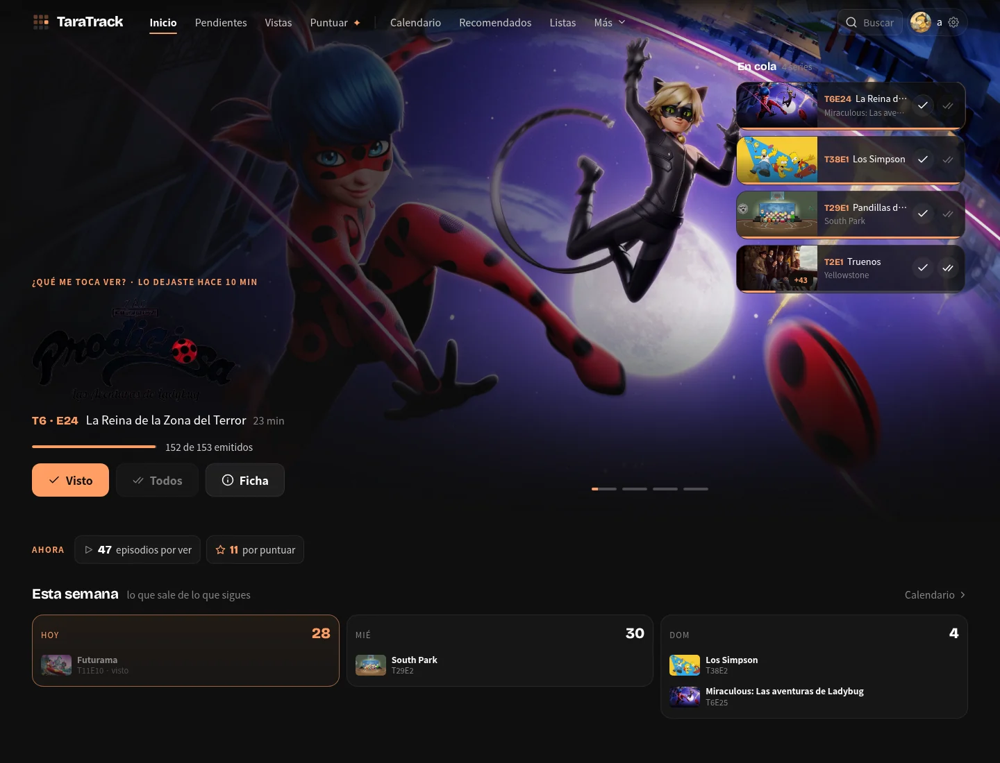
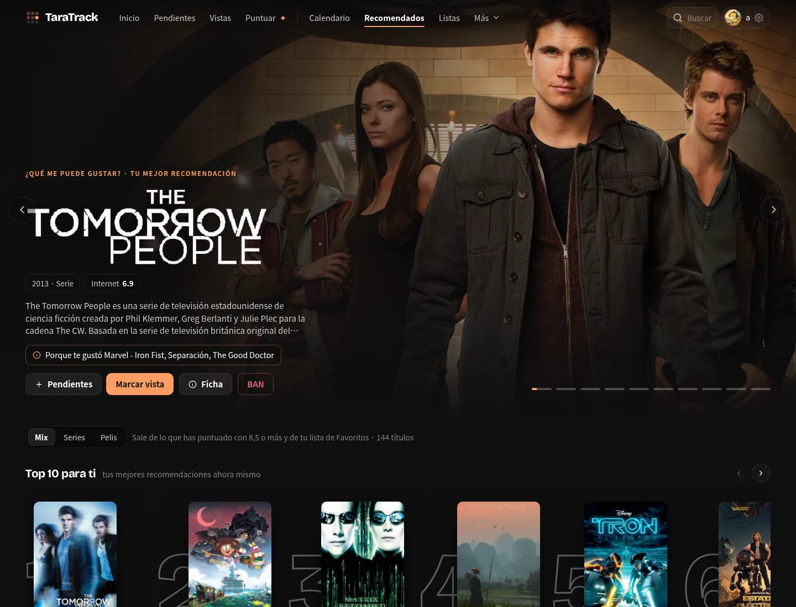
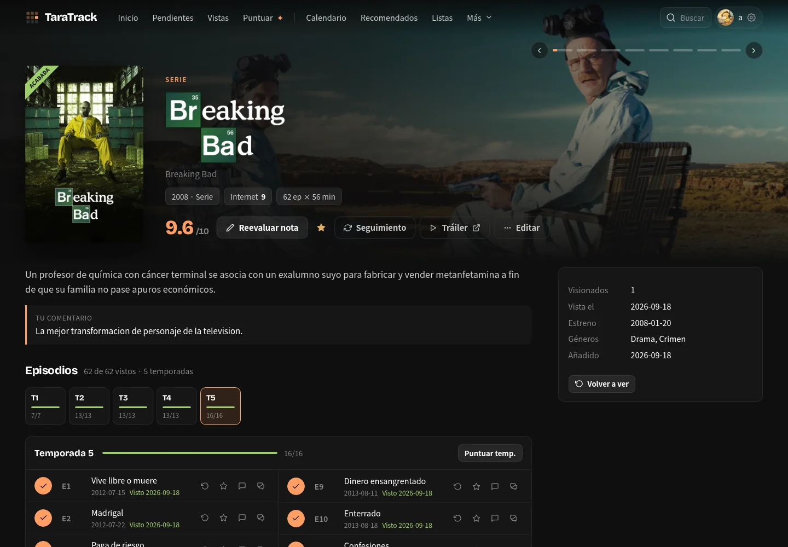
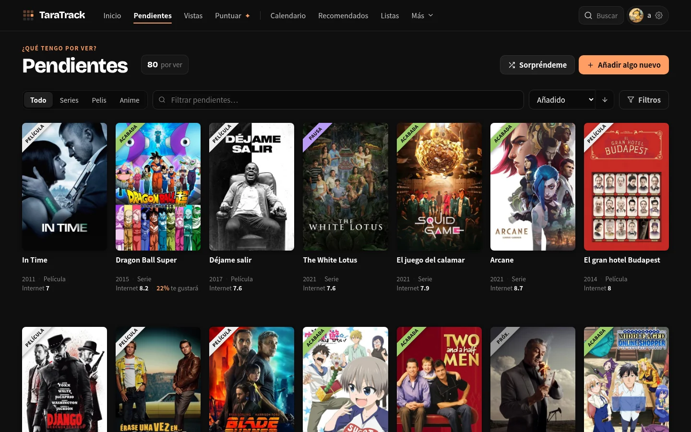
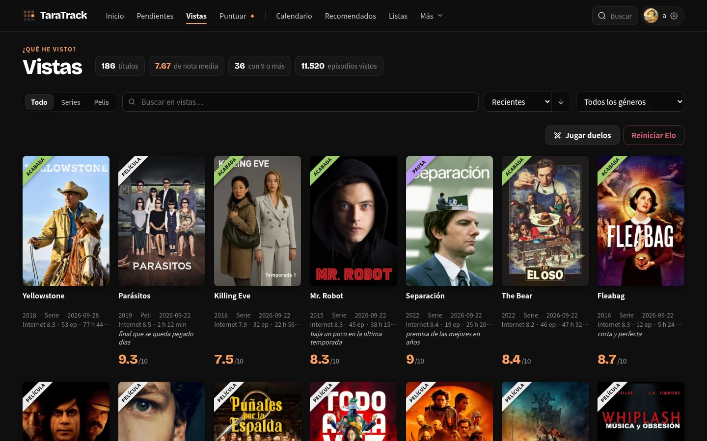
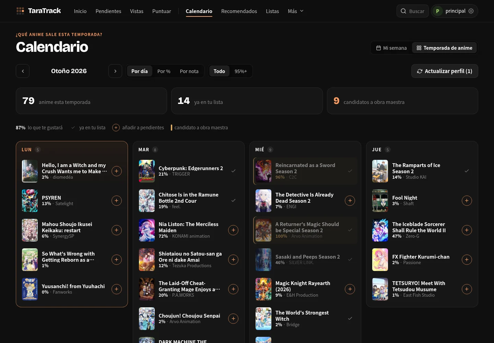
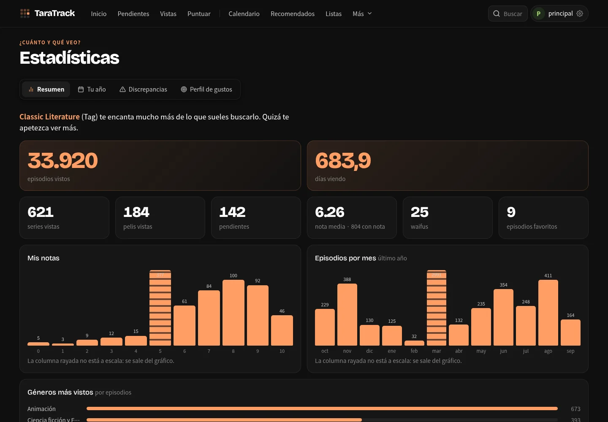
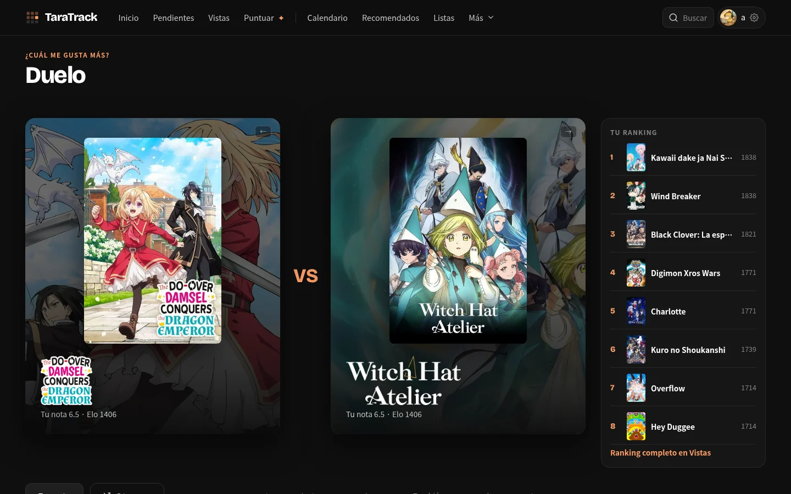
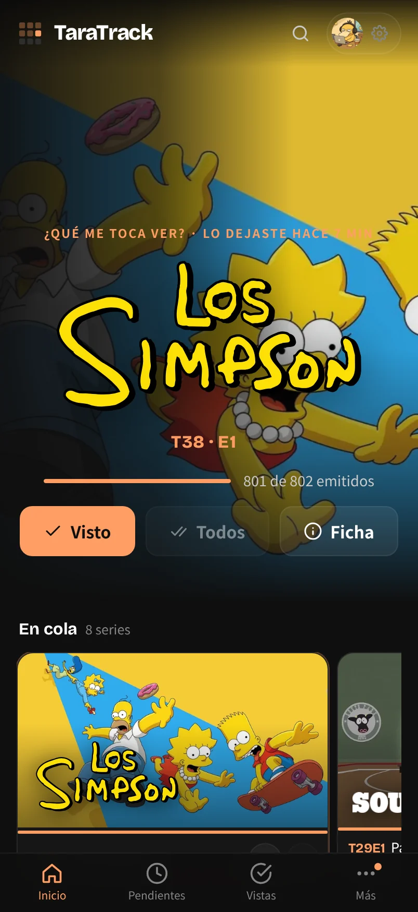
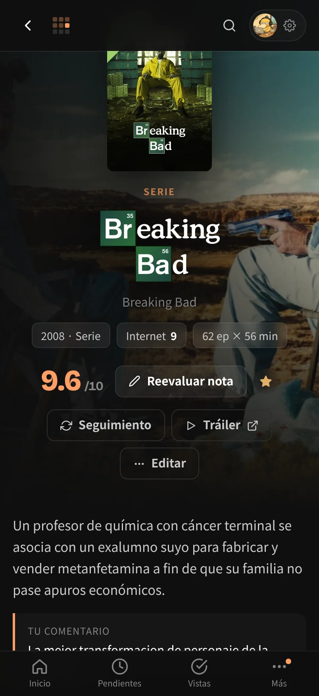

<p align="center"></p>

# TaraTrack

> Tu historial de series, películas y anime; tus notas, tus gustos y tus recomendaciones, en tu propio servidor.

No intenta ser otra base de datos de títulos: intenta entender qué te apetece, no solo qué has visto.

Tracker personal autoalojado, sustituto propio de Trakt/TV Time. FastAPI + Jinja2 + htmx + SQLite, renderizado en el servidor y sin paso de build en el frontend.

Los metadatos vienen de TMDB (y de Jikan/AniList para anime), pero en la base de datos solo se guarda lo que sigues: lo pendiente, lo visto, tus notas, tus listas y tus personajes favoritos.

## Capturas

_(biblioteca de ejemplo)_

**Inicio**: el siguiente episodio en grande, la cola al lado y lo que sale esta semana.


**Recomendados**: portada con las mejores y filas que se pasan con flechas (Top 10, «porque te gustó…», por género y anime de la temporada).


**Ficha**: fondos del título que van rotando, tu nota, episodios por temporada y los datos al lado.


| Pendientes | Vistas |
|---|---|
|  |  |

| Calendario | Estadísticas |
|---|---|
|  |  |



En el móvil, y como app instalada en la pantalla de inicio:

<p>
  
  
</p>

## Hecho para usarlo cada día

- **Cada pantalla responde a una pregunta**: ¿qué me toca ver? (Inicio), ¿qué quiero empezar? (Pendientes), ¿qué he visto y cuánto me gustó? (Vistas). La imagen del título manda y los controles aparecen cuando hacen falta.
- **Nunca pierdes historial al volver a ver algo**: un rewatch no borra ninguna fecha anterior, solo recalcula qué falta ahora.
- **Recomendaciones explicables, no una caja negra**: cada predicción se apoya en dos ejes separados (cuánto lo persigues y cuánto te gusta cuando lo ves) y se valida contra tu propio historial, no contra una nota media genérica.
- **Calendario de temporada con predicción propia**: todo el anime de la temporada con el mismo diseño que tu calendario semanal y un «% que te va a gustar» calculado desde tus notas, nunca desde la nota de la crítica.
- **Ranking por duelos con Glicko**: cada elemento lleva su propia incertidumbre, así que el ranking se afina con menos duelos que con un Elo clásico.
- **Multiusuario**: cuentas aisladas por invitación, no una contraseña compartida.
- **Autoalojado y privado**: tus datos personales no salen de tu servidor; TMDB/AniList/Jikan solo se consultan para traer metadatos.

## Arrancar en local

```bash
cp .env.example .env   # rellena TMDB_API_KEY, TARATRACK_SECRET_KEY y TARATRACK_PASSWORD
pip install -r requirements.txt
uvicorn app.main:app --reload --env-file .env
```

Abre http://127.0.0.1:8000. El esquema se crea solo al arrancar (`init_db()`): no hay paso de migración manual.

La única credencial externa necesaria es una API key v3 de [TMDB](https://www.themoviedb.org/settings/api) (gratis). Jikan y AniList no piden key. Sin `TARATRACK_SECRET_KEY` el arranque falla a propósito, no hay valor por defecto. Para Docker y despliegue en un servidor, ver [`docs/architecture.md`](docs/architecture.md).

### Comprobar que funciona

```bash
pytest -q
ruff check .
```

## Funciones

- **Inicio**: portada con el siguiente episodio y la cola de lo que tienes a medias al lado (marcar visto, todos los emitidos o ir a la ficha), una franja con lo pendiente en números y la semana de estrenos. Lo que está vacío no se pinta.
- **Pendientes y Vistas**: filtros sin recargar la página, cifras arriba (candidatos a obra maestra en Pendientes, nota media en Vistas) y tu nota como protagonista de cada tarjeta en Vistas. Vistas carga por tandas al bajar.
- **Recomendados**: sin rejilla gigante; filas horizontales como en una plataforma de streaming, con la sinopsis al pasar el ratón, y el listado completo aparte.
- **Ficha**: los fondos del título rotan con barra de tiempo, flechas y teclado; un admin puede quitar los que no se ven bien. Los fondos de lo que has visto se guardan en el servidor.
- **Puntuación por categorías**: un examen corto (Historia, Animación, Personajes, Música, Disfrute) con pesos distintos por categoría en vez de un número suelto.
- **Calendarios**: semana propia y temporada de anime con el mismo esqueleto, sincronización automática cada 12 h.
- **Listas ilimitadas** con orden manual o por duelos (mismo motor Glicko que el ranking general).
- **Autover**: series de muchos episodios que sigues sin pensarlo se marcan vistas solas.
- **Personajes de anime, no actores**: para anime se tira de AniList/Jikan en vez del reparto de TMDB.
- **Estadísticas en una sola página**: resumen, tu año, dónde discrepas con la crítica y el perfil de gustos, con un índice fijo.
- **Historial** por días, con los episodios de una misma serie agrupados.
- **Exportación completa de tus datos** en JSON, pensada para migrar a otra herramienta si hace falta, no solo como copia de seguridad.

## Índice de afinidad

```
apetito + calidad  →  afinidad     (cuánto te va a gustar)
apetito − calidad  →  inercia      (costumbre vs. gusto real)
predicción         →  backtesting  (validada contra tu propio historial)
```

La app no se queda en «nota media por género»: eso castiga justo lo que más consumes (a más volumen visto de un género, más obras mediocres de ese género entran en la media, y la media baja). En vez de una sola métrica, `app/repo/affinity.py` (~1200 líneas) separa dos ejes por atributo (género/tag/estudio):

- **Apetito**: cuánto lo persigues. Volumen (episodios, agrupados por franquicia con union-find sobre precuelas), qué cuota de tu consumo se lleva frente al resto de tu biblioteca, ritmo al salir episodios, si lo ves el día 1, rewatches y si lo has curado en listas propias.
- **Calidad**: cuánto te gusta cuando lo ves. Percentil 85 de tus notas en ese atributo (no la media, que se hunde con el volumen), percentil 25, disfrute y corrección por tu ranking de duelos Glicko.

Ambos se normalizan a percentil dentro de tu propio perfil y se combinan con **media geométrica ponderada y castigo si te alejas de la diagonal**: `base = apetito^0.6 · calidad^0.4`, y si el apetito supera a la calidad por más de 25 puntos, la afinidad se recorta hasta un 50 %. Esa diferencia (apetito − calidad) es la **inercia**: positiva, lo persigues más de lo que te gusta; negativa, te gusta más de lo que lo persigues.

El score final no se enseña en crudo: se calibra contra la distribución de tus propias notas («95 %» = mejor que el 95 % de lo que has visto) y se valida con **backtesting leave-one-out**, que recalcula el perfil sacando cada título puntuado, predice su nota sin haberlo visto y la compara con la real (`scripts/tune_affinity_weights.py` hace un grid search de los pesos con ese mismo mecanismo).

**Marcado de hábito** (`entries.is_habit`): series de fondo que ves por costumbre se excluyen del eje apetito (no del de calidad, tu nota sigue contando) para que no inflen esa métrica solo por volumen.

## Multiusuario

Varias cuentas en la misma instancia, pensado para unas pocas personas de confianza compartiendo un despliegue, no para un servicio público. Cada una tiene su propio seguimiento, notas, listas, índice de afinidad, duelos y personajes favoritos; solo el catálogo de títulos y episodios se comparte (evita descargar los mismos metadatos dos veces).

- **Cuentas por invitación**: un admin crea la cuenta con solo el nombre y la app genera un código de un solo uso que caduca en 7 días. La persona entra en `/activar`, elige su contraseña y el código se destruye; el admin nunca la conoce. No hay registro abierto.
- **Recuperar el acceso**: un código nuevo invalida la contraseña anterior hasta que se active. No hace falta email.
- **Gestión**: dar o quitar el rol de admin, bloquear una cuenta (conserva los datos pero no puede entrar, ni con una sesión ya abierta) o borrarla con todo lo suyo.
- **Contraseñas** con `pbkdf2_hmac` (sin dependencias nuevas), límite de intentos por cuenta y por IP en el login y en la activación.
- **Comentarios por episodio**: la única pieza que se ve entre cuentas, un hilo por episodio oculto hasta que tú mismo lo has marcado como visto.
- **Términos que se adaptan**: si una cuenta no tiene anime, «Waifus» pasa a «Personajes favoritos» y la pestaña de anime no aparece.

## Privacidad y límites

- Los datos se quedan en tu instancia; TMDB/AniList/Jikan solo reciben peticiones de metadatos, nunca tus notas ni tu biblioteca.
- La sesión es una cookie firmada de larga duración; «Cerrar sesión» en Ajustes la borra.
- Haz copia del volumen de datos y de los de imágenes si despliegas con Docker, ver [`docs/architecture.md`](docs/architecture.md).

## Diseño

Tema único y oscuro, con una paleta propia de negro y naranja y tres capas de profundidad (fondo, superficie, elevación). Pensado como un producto de uso diario, no como un panel de administración:

- La imagen del título es la protagonista: portadas a pantalla completa en Inicio, Recomendados, Sorpréndeme y la ficha.
- Una receta por pieza: el mismo tipo de botón, pastilla y tarjeta en todas las páginas; en escritorio, los botones de cada tarjeta aparecen al pasar el ratón.
- Nada de `window.confirm()` ni `alert()`: las acciones destructivas se confirman en dos pasos.
- Adaptado al móvil (barra inferior, portadas centradas, imágenes a la resolución de la pantalla) e instalable como app en iOS.

## Calidad y arquitectura

35 módulos (rutas por dominio y capa de datos separada por subsistema), sin ORM y sin SQL fuera de esa capa, 48 plantillas; 177 tests y `ruff` en cada despliegue. Login propio con clave de sesión obligatoria, límite de intentos y validación de subidas (ver [`docs/engineering-notes.md`](docs/engineering-notes.md)). Estructura, modelo de datos y Docker en [`docs/architecture.md`](docs/architecture.md).

## Estado

En desarrollo activo y en uso diario desde hace meses. Es mi segundo proyecto de este verano (el primero fue [TarArch](https://github.com/Tara7ara/TarArch), mi escritorio Linux). Licencia MIT. Issues y PRs bienvenidos; para cambios grandes, mejor abrir antes una issue. Los metadatos de series, películas y anime son de [TMDB](https://www.themoviedb.org/) (This product uses the TMDB API but is not endorsed or certified by TMDB), [AniList](https://anilist.co/) y [Jikan](https://jikan.moe/) (MyAnimeList).

## Más detalle

- [`docs/architecture.md`](docs/architecture.md): estructura de carpetas, modelo de datos, tests, Docker, sincronización de fondo y scripts de importación.
- [`docs/engineering-notes.md`](docs/engineering-notes.md): cuatro problemas resueltos: migraciones SQLite idempotentes, matching TMDB/AniList sin falsos positivos, backtesting sin fuga de datos y la seguridad de sesiones y cookies.
